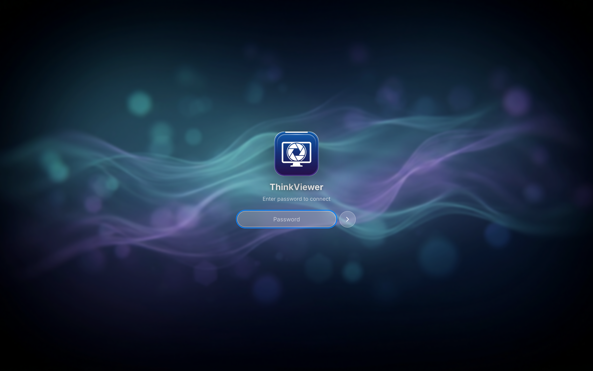
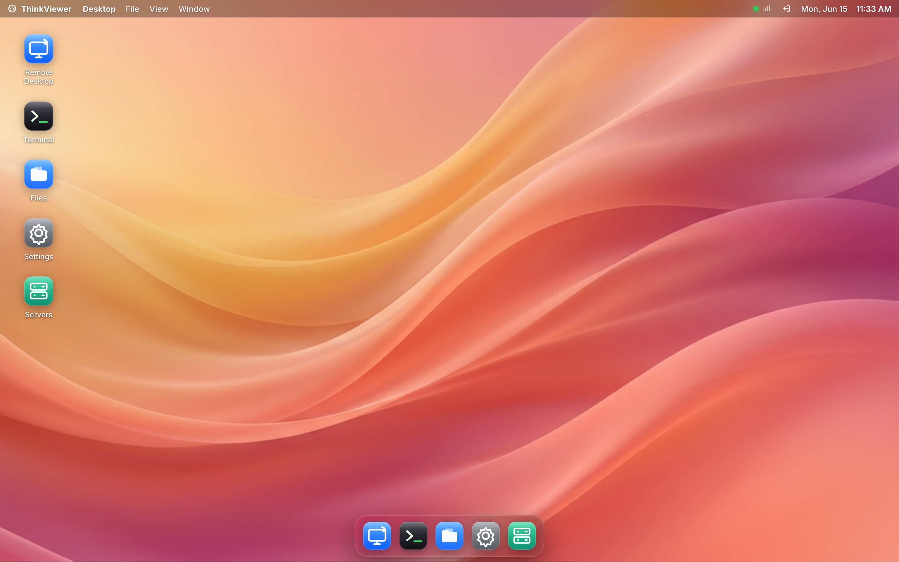
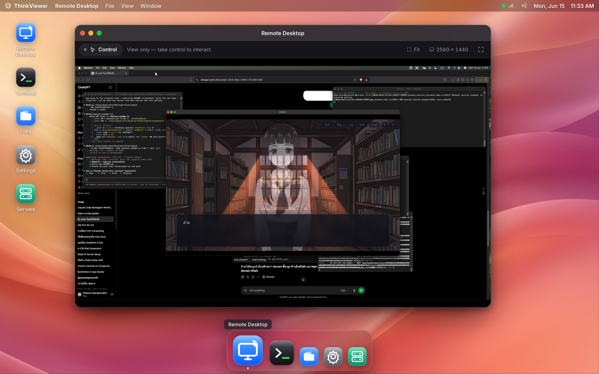
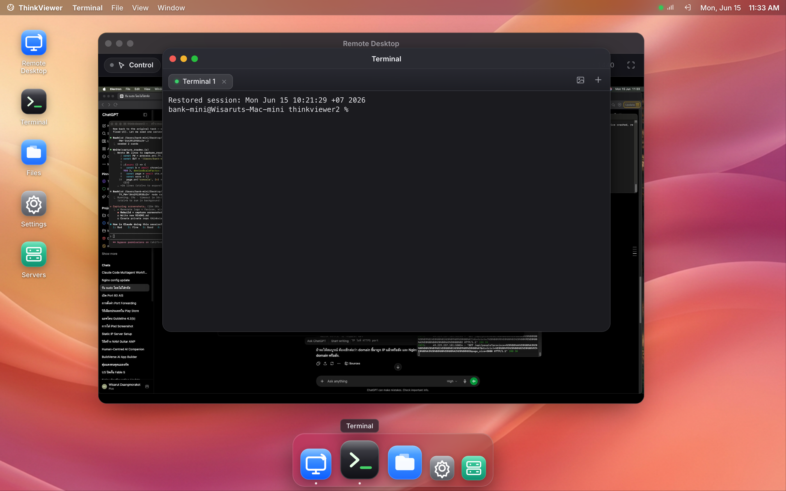
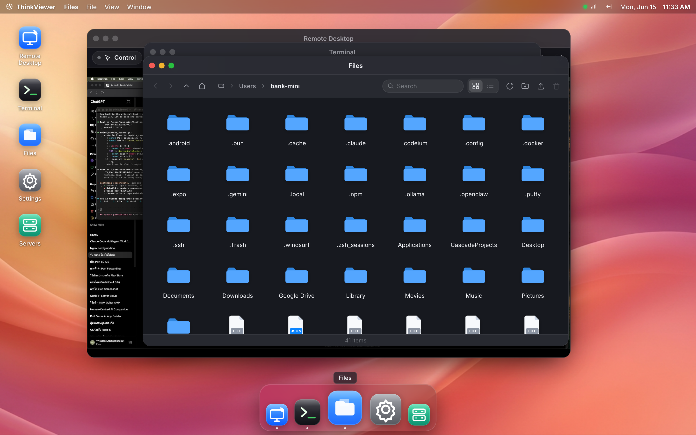
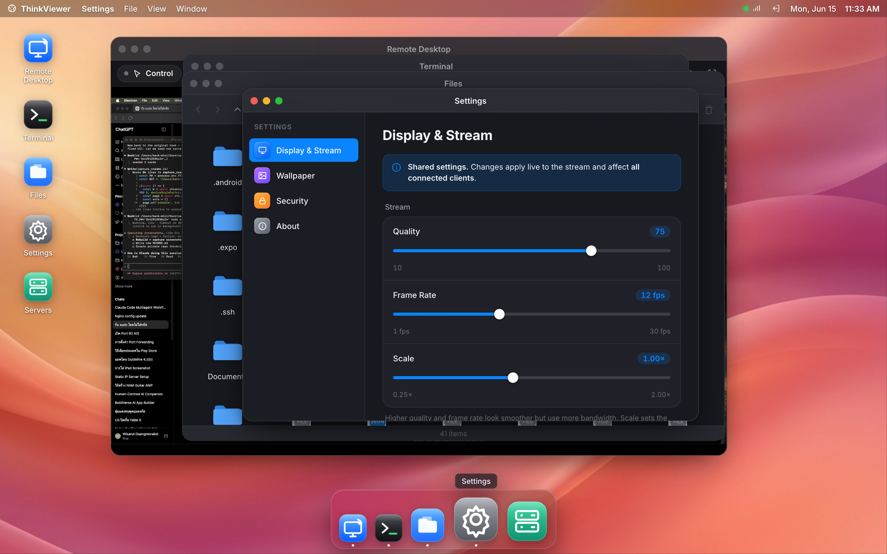
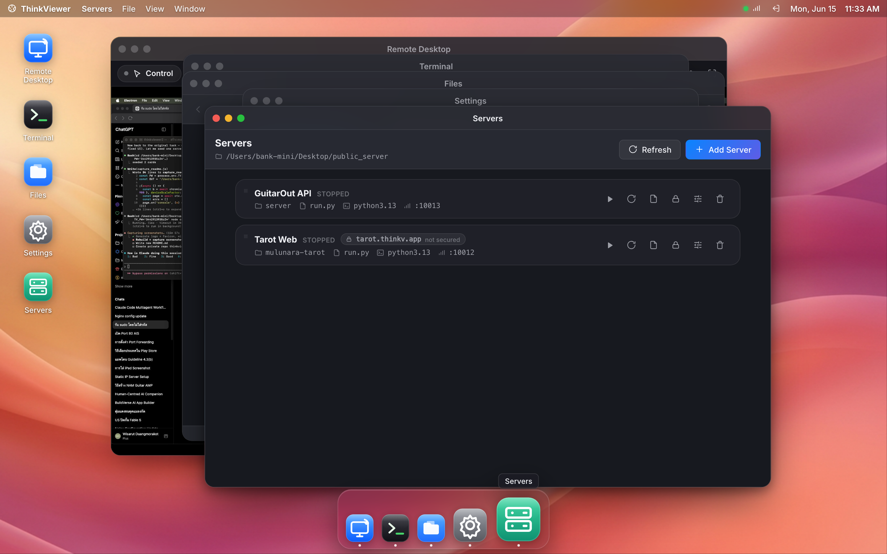

<p align="center">
  
</p>

<h1 align="center">ThinkViewer</h1>

<p align="center">
  A self-hosted remote-desktop, terminal, file manager & server console —<br/>
  delivered as a beautiful <strong>macOS-style desktop in your browser</strong>.
</p>

<p align="center">
  
</p>

---

ThinkViewer turns any Mac (or Linux box) into a remote workstation you control from a web browser — like TeamViewer, but self-hosted and open. A Python/FastAPI **engine** does the host-OS work; a **React + TypeScript single-page app** renders a full draggable-window desktop with a dock, menu bar, wallpapers, and apps.

<p align="center">
  
</p>

## ✨ Features

- 🖥️ **Remote Desktop** — live screen streaming with full mouse + keyboard control, take/release control, fit & fullscreen, HiDPI-aware.
- 🐚 **Terminal** — real PTY terminals (xterm.js) with multi-session tabs **synced across all connected clients**, plus image paste (Claude-Code compatible).
- 📁 **Files** — a Finder-style file manager: icon/list views, breadcrumb navigation, **drag-and-drop upload** with progress, download, mkdir & delete.
- ⚙️ **Settings** — stream quality/fps/scale, a wallpaper picker (upload your own), password change, and connection info.
- 🚀 **Servers** — a built-in **process manager** for your other apps: start/stop/restart, live logs, status + port health, pick the entry file (incl. subdirectories) and Python interpreter (venv / pyenv / system), with an auto-detected default port.
- 🔒 **One-click HTTPS** — assign a domain to any service and publish it with **nginx + Let's Encrypt** (certbot), straight from the UI.
- 🎨 **macOS-grade UI** — glassy windows with traffic-light controls, a magnifying dock, smooth motion, light/dark tokens, and AI-generated wallpapers.

## 🖼️ Screenshots

| Remote Desktop | Terminal |
|---|---|
|  |  |

| Files | Settings |
|---|---|
|  |  |

| Servers (process manager + one-click HTTPS) |
|---|
|  |

## 🏗️ Architecture

```
React SPA (frontend/dist)  ──single WebSocket /ws + REST /api──▶  FastAPI engine (run.py)
                                                                   ├── ScreenStreamer  (mss → JPEG → raw-binary WS frames)
                                                                   ├── InputHandler    (pyautogui / Quartz on macOS)
                                                                   ├── TerminalManager (os.fork + pty, multi-client sync)
                                                                   ├── FileManager     (REST)
                                                                   ├── ServerManager   (spawn / monitor sibling apps + HTTPS)
                                                                   └── Auth            (SQLite, 24h tokens)
```

The backend stays Python because it needs host-OS access a browser can't have (screen capture, input injection, PTYs). The screen stream and per-frame input **bypass React entirely** (decoded to an uncontrolled `<canvas>`), so the UI stays fluid even at speed.

- **Backend:** one file, `run.py` (FastAPI). State in SQLite (`thinkviewer.db`).
- **Frontend:** `frontend/` — Vite + React 18 + TypeScript, Zustand, framer-motion, xterm.js. Built to `frontend/dist`, served by the backend.

## 🚀 Quick start

**Requirements:** Python 3.11+, Node 18+ (to build the UI).

```bash
# 1) Backend deps
pip install -r requirements.txt

# 2) Build the UI
cd frontend && npm install && npm run build && cd ..

# 3) Run (serves the API, WebSocket and the built UI on one port)
python run.py
```

Open **http://localhost:19080** and log in. The password is auto-generated and printed on first run (or set `THINKVIEWER_PASSWORD`).

### Development

Run the engine and the Vite dev server side by side (HMR + same-origin proxy):

```bash
python run.py                       # terminal A — engine on :19080
cd frontend && npm run dev          # terminal B — UI on :5173 (proxies /api, /ws, /static)
```

## 🔒 Publishing a service with HTTPS

The **Servers** app can put any managed service online with a real certificate:

1. Add a server — pick its folder (subdirectories like `app/server` are supported), entry file, interpreter and port (auto-suggested), then **Start** it.
2. Click **Publish / HTTPS**, enter your domain, optionally **Check reachability**, then **Deploy**.
3. Approve the macOS administrator prompt **on the host** — nginx is configured as a reverse proxy and certbot issues a Let's Encrypt cert with auto-renewal.

Requires `brew install nginx certbot`, a DNS **A record** → the host's public IP, and inbound ports **80/443** open.

## ⚙️ Configuration

| Variable | Default | Description |
|---|---|---|
| `THINKVIEWER_PASSWORD` | _auto-generated_ | Login password |
| `THINKVIEWER_PORT` | `19080` | Server port |
| `THINKVIEWER_BIND` | `127.0.0.1` | Bind address (`0.0.0.0` to expose on LAN) |
| `THINKVIEWER_AUTOUPDATE` | `1` | Git auto-update on/off |
| `THINKVIEWER_SERVERS_DIR` | `~/Desktop/public_server` | Base dir the Servers app manages |
| `THINKVIEWER_MAX_UPLOAD_MB` | `2048` | File-upload size cap |

## 🔐 Security

ThinkViewer grants **full screen control and shell access** to anyone with the password. By default it binds to `127.0.0.1` (localhost only). Before exposing it:

- Set a strong `THINKVIEWER_PASSWORD`.
- Put it behind **HTTPS** (the built-in deploy flow or a reverse proxy) — never plain HTTP over the internet.
- Treat the device as fully controllable by any authenticated user.

## 🧰 Tech stack

**Backend:** FastAPI · uvicorn · mss · Pillow · pyautogui · pyobjc (Quartz) · SQLite
**Frontend:** React 18 · TypeScript · Vite · Zustand · framer-motion · @xterm/xterm

---

<p align="center"><sub>Self-hosted. Your machine, your data.</sub></p>
