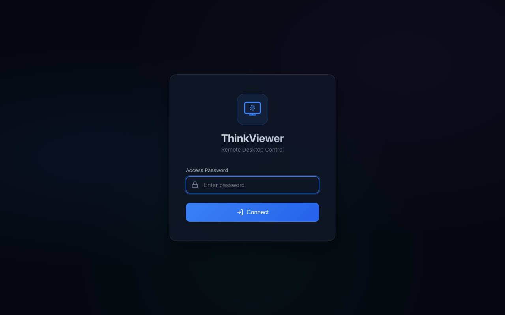
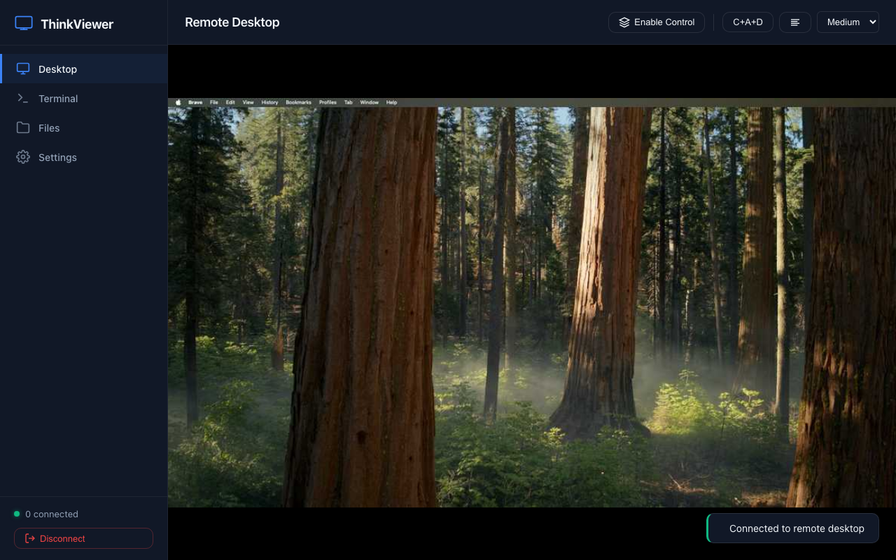
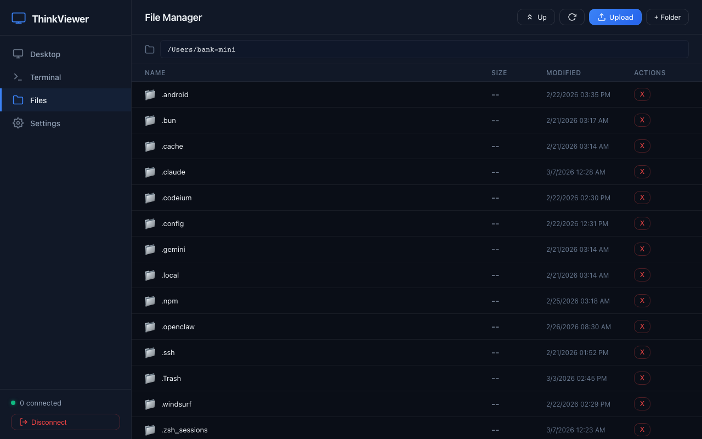
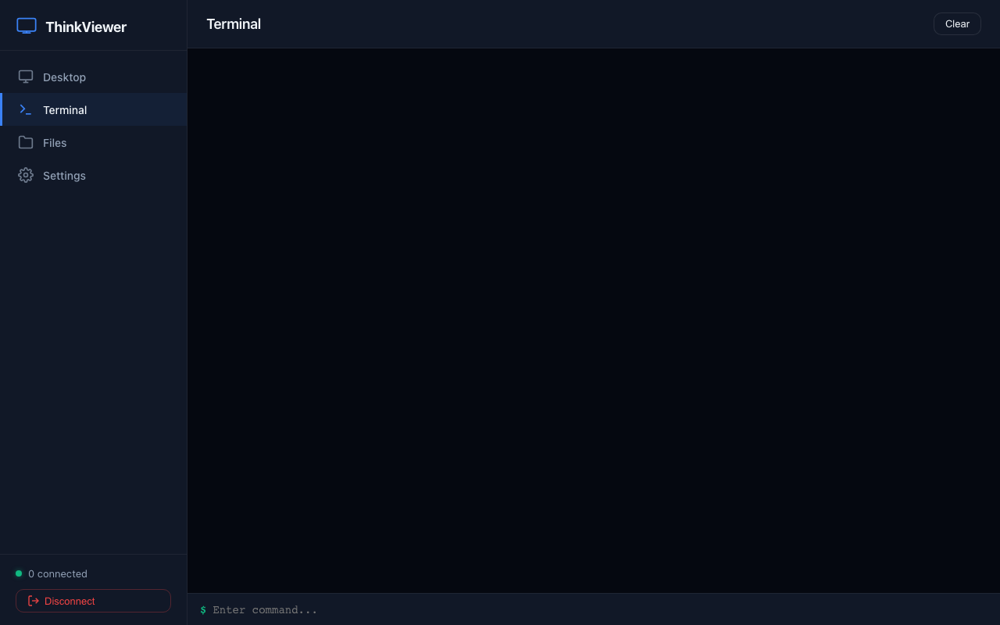
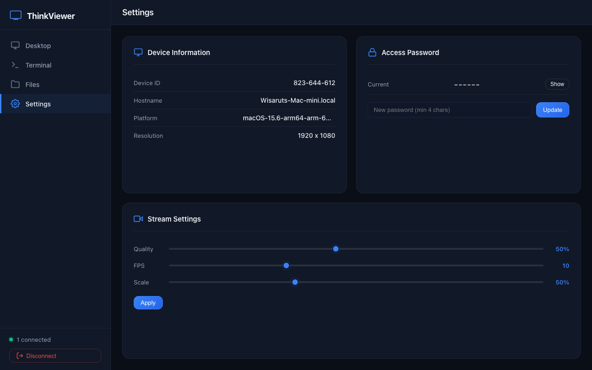

# ThinkViewer

ThinkViewer is a lightweight, browser-based remote desktop control application. It allows you to view and control your computer remotely via a web interface, similar to TeamViewer, but hosted on your own machine.

## Features

- **High-Performance Screen Streaming**: Real-time desktop capture using MSS and PIL, streamed over WebSockets.
- **Remote Control**: Support for mouse movement, clicks (left/right/double), scrolling, and keyboard input (including hotkeys).
- **File Manager**: Full file system access (List, Upload, Download, Delete, Mkdir) through the browser.
- **Remote Terminal**: Execute shell commands directly from the web interface.
- **Secure Authentication**: Password-protected access with session management.
- **Configurable Streaming**: Adjustable quality, FPS, and scale to balance performance and bandwidth.
- **Multi-Platform**: Works on Windows, macOS, and Linux (anywhere Python and its dependencies run).

## Installation

### Prerequisites

- Python 3.8+
- Node.js (for testing/optional JS dependencies)

### Setup

1. **Clone the repository:**
   ```bash
   git clone https://github.com/bank-mini/thinkviewer.git
   cd thinkviewer
   ```

2. **Install Python dependencies:**
   ```bash
   pip install -r requirements.txt
   ```

3. **Install Node.js dependencies (Optional, for Playwright tests):**
   ```bash
   npm install
   ```

## Usage

1. **Start the ThinkViewer server:**
   ```bash
   python main.py
   ```

2. **Access the web interface:**
   Open your browser and navigate to `http://localhost:19080` (or your machine's IP address on the local network).

3. **Login**:
   - The first time you run ThinkViewer, it will generate a **Device ID** and a **Password** which will be printed in the terminal.
   - You can also set a custom password in a `.env` file:
     ```env
     THINKVIEWER_PASSWORD=your_secure_password
     THINKVIEWER_PORT=19080
     ```

## Screenshots

### 1. Login Page


### 2. Desktop View


### 3. File Manager


### 4. Terminal View


### 5. Settings Page


## Technology Stack

- **Backend**: FastAPI (Python), WebSocket, SQLite, MSS, PIL, PyAutoGUI.
- **Frontend**: HTML5, Vanilla CSS, JavaScript.
- **Testing**: Playwright (JS).

## License

ISC License. See [package.json](package.json) for details.

## Disclaimer

**Security Warning**: This tool allows full remote control of your computer. Ensure you use a strong password and only expose the port on trusted networks. Use at your own risk.
